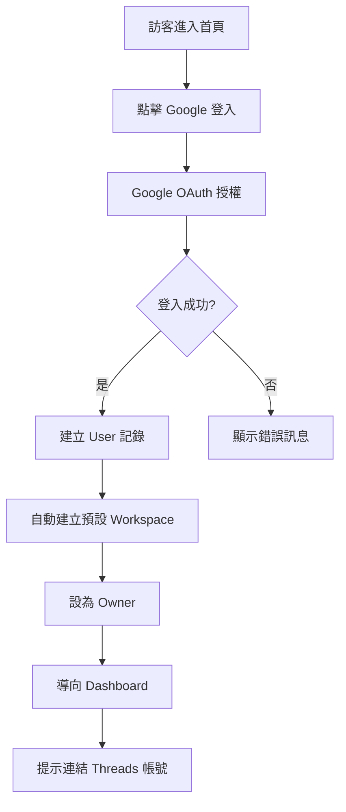
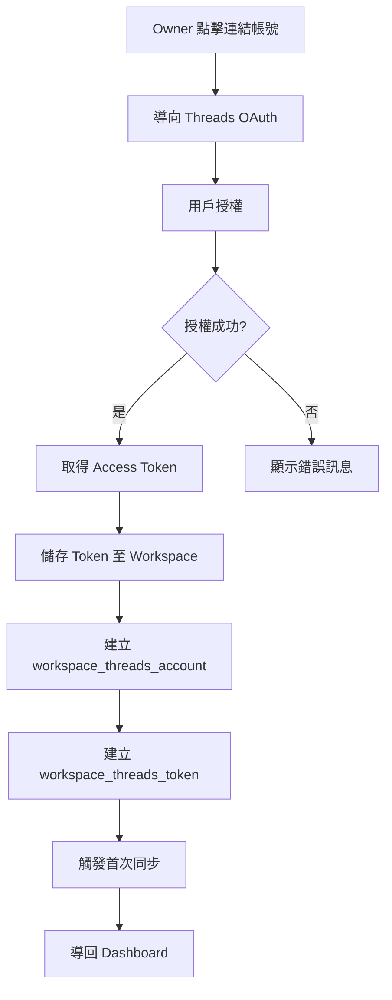
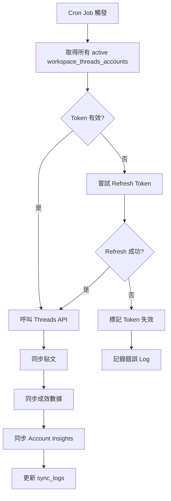
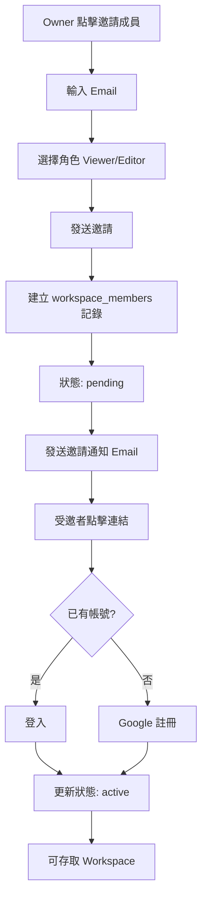
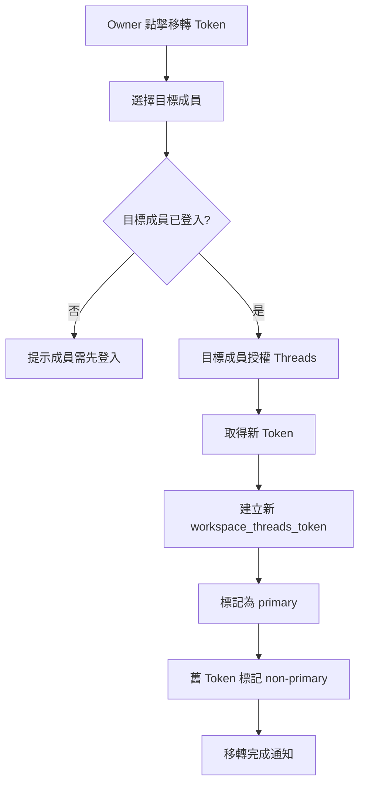
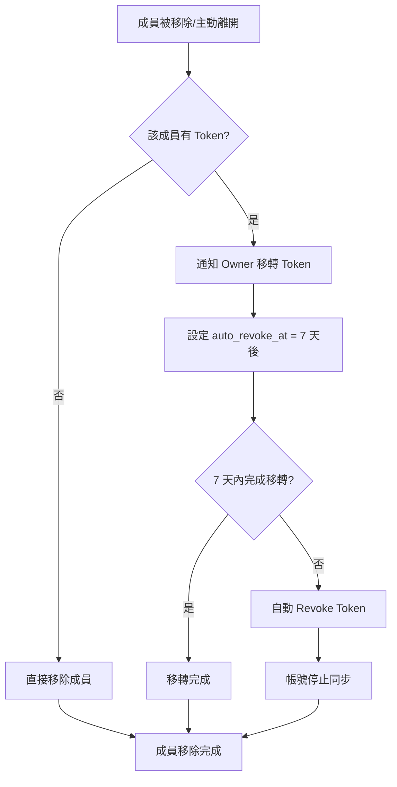
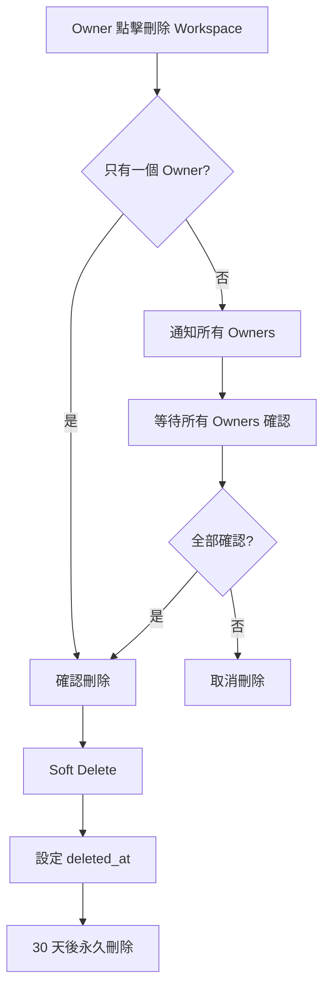
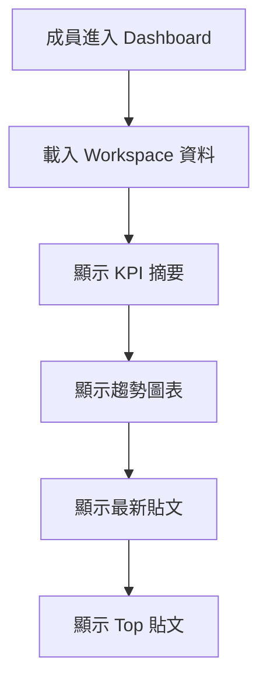

# 使用者流程

## 1. 新使用者註冊流程

```mermaid
flowchart TD
    A[訪客進入首頁] --> B[點擊 Google 登入]
    B --> C[Google OAuth 授權]
    C --> D{登入成功?}
    D -->|是| E[建立 User 記錄]
    D -->|否| F[顯示錯誤訊息]
    E --> G[自動建立預設 Workspace]
    G --> H[設為 Owner]
    H --> I[導向 Dashboard]
    I --> J[提示連結 Threads 帳號]
```

---

## 2. 連結 Threads 帳號流程

```mermaid
flowchart TD
    A[Owner 點擊連結帳號] --> B[導向 Threads OAuth]
    B --> C[用戶授權]
    C --> D{授權成功?}
    D -->|是| E[取得 Access Token]
    D -->|否| F[顯示錯誤訊息]
    E --> G[儲存 Token 至 Workspace]
    G --> H[建立 workspace_threads_account]
    H --> I[建立 workspace_threads_token]
    I --> J[觸發首次同步]
    J --> K[導回 Dashboard]
```

---

## 3. 資料同步流程

```mermaid
flowchart TD
    A[Cron Job 觸發] --> B[取得所有 active workspace_threads_accounts]
    B --> C{Token 有效?}
    C -->|是| D[呼叫 Threads API]
    C -->|否| E[嘗試 Refresh Token]
    E --> F{Refresh 成功?}
    F -->|是| D
    F -->|否| G[標記 Token 失效]
    G --> H[記錄錯誤 Log]
    D --> I[同步貼文]
    I --> J[同步成效數據]
    J --> K[同步 Account Insights]
    K --> L[更新 sync_logs]
```

---

## 4. 邀請成員流程

```mermaid
flowchart TD
    A[Owner 點擊邀請成員] --> B[輸入 Email]
    B --> C[選擇角色 Viewer/Editor]
    C --> D[發送邀請]
    D --> E[建立 workspace_members 記錄]
    E --> F[狀態: pending]
    F --> G[發送邀請通知 Email]
    G --> H[受邀者點擊連結]
    H --> I{已有帳號?}
    I -->|是| J[登入]
    I -->|否| K[Google 註冊]
    J --> L[更新狀態: active]
    K --> L
    L --> M[可存取 Workspace]
```

---

## 5. Token 移轉流程

```mermaid
flowchart TD
    A[Owner 點擊移轉 Token] --> B[選擇目標成員]
    B --> C{目標成員已登入?}
    C -->|否| D[提示成員需先登入]
    C -->|是| E[目標成員授權 Threads]
    E --> F[取得新 Token]
    F --> G[建立新 workspace_threads_token]
    G --> H[標記為 primary]
    H --> I[舊 Token 標記 non-primary]
    I --> J[移轉完成通知]
```

---

## 6. 成員離開處理流程

```mermaid
flowchart TD
    A[成員被移除/主動離開] --> B{該成員有 Token?}
    B -->|否| C[直接移除成員]
    B -->|是| D[通知 Owner 移轉 Token]
    D --> E[設定 auto_revoke_at = 7 天後]
    E --> F{7 天內完成移轉?}
    F -->|是| G[移轉完成]
    F -->|否| H[自動 Revoke Token]
    H --> I[帳號停止同步]
    C --> J[成員移除完成]
    G --> J
    I --> J
```

---

## 7. Workspace 刪除流程

```mermaid
flowchart TD
    A[Owner 點擊刪除 Workspace] --> B{只有一個 Owner?}
    B -->|是| C[確認刪除]
    B -->|否| D[通知所有 Owners]
    D --> E[等待所有 Owners 確認]
    E --> F{全部確認?}
    F -->|是| C
    F -->|否| G[取消刪除]
    C --> H[Soft Delete]
    H --> I[設定 deleted_at]
    I --> J[30 天後永久刪除]
```

---

## 8. 查看 Dashboard 流程

```mermaid
flowchart TD
    A[成員進入 Dashboard] --> B[載入 Workspace 資料]
    B --> C[顯示 KPI 摘要]
    C --> D[顯示趨勢圖表]
    D --> E[顯示最新貼文]
    E --> F[顯示 Top 貼文]
```
