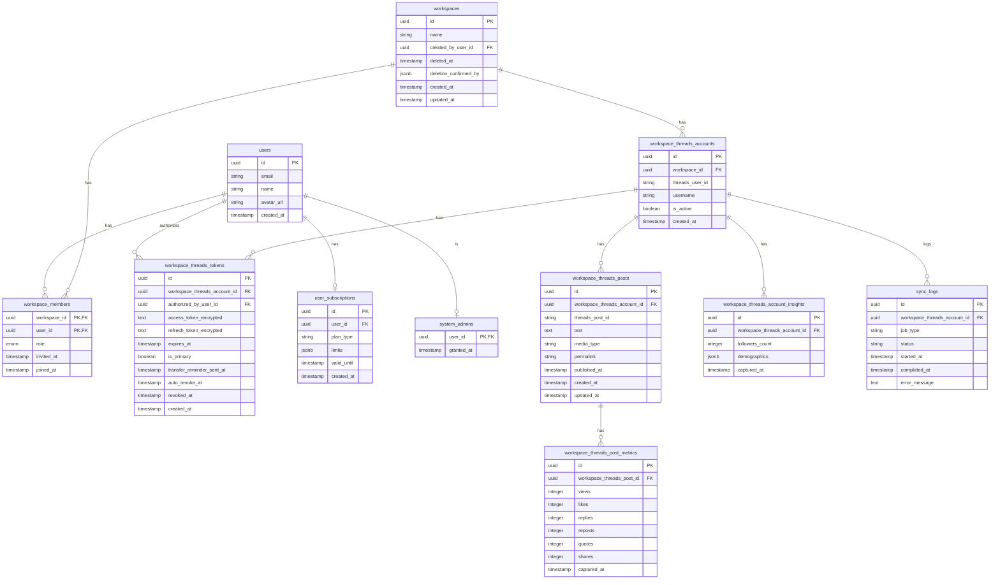
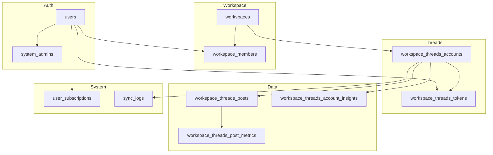

# ERD (Entity Relationship Diagram)

## 完整 ERD

---

## 簡化關係圖

---

## 主要關係說明

| 關係 | 類型 | 說明 |
|------|------|------|
| User → WorkspaceMember | 1:n | 一個用戶可加入多個 Workspace |
| Workspace → WorkspaceMember | 1:n | 一個 Workspace 有多個成員 |
| Workspace → ThreadsAccount | 1:n | 一個 Workspace 可綁定多個 Threads 帳號 |
| ThreadsAccount → Token | 1:n | 支援多 Token（移轉用） |
| ThreadsAccount → Post | 1:n | 一個帳號有多篇貼文 |
| Post → Metrics | 1:n | 每篇貼文有多筆成效快照 |
| User → Subscription | 1:1 | 每個用戶一個訂閱方案 |
