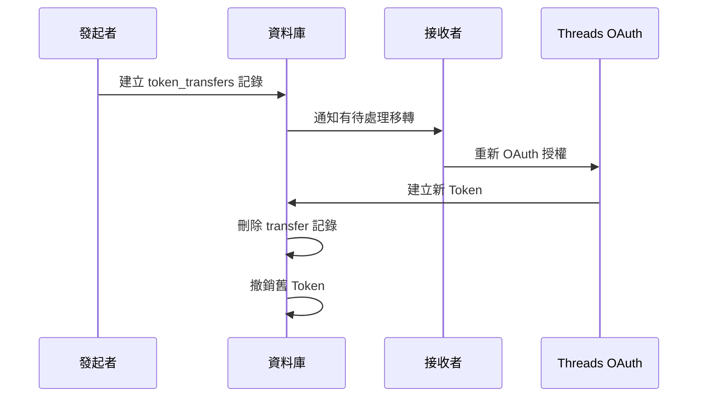

# token_transfers

## 概述

Token 移轉記錄表，用於追蹤待處理的 Token 所有權移轉請求。

---

## Schema

```sql
CREATE TABLE token_transfers (
  id UUID PRIMARY KEY DEFAULT gen_random_uuid(),
  workspace_threads_account_id UUID NOT NULL REFERENCES workspace_threads_accounts(id) ON DELETE CASCADE,
  initiated_by UUID NOT NULL REFERENCES auth.users(id),
  target_user_id UUID NOT NULL REFERENCES auth.users(id),
  expires_at TIMESTAMPTZ NOT NULL,
  created_at TIMESTAMPTZ NOT NULL DEFAULT NOW()
);

CREATE INDEX idx_transfers_account ON token_transfers(workspace_threads_account_id);
CREATE INDEX idx_transfers_target ON token_transfers(target_user_id);
```

---

## 欄位說明

| 欄位 | 類型 | 說明 |
|------|------|------|
| `id` | UUID (PK) | 移轉記錄 ID |
| `workspace_threads_account_id` | UUID (FK) | 要移轉的 Threads 帳號 ID |
| `initiated_by` | UUID (FK) | 發起移轉的使用者 ID |
| `target_user_id` | UUID (FK) | 接收移轉的使用者 ID |
| `expires_at` | TIMESTAMPTZ | 移轉邀請過期時間 |
| `created_at` | TIMESTAMPTZ | 建立時間 |

---

## 索引

| 索引名稱 | 欄位 | 用途 |
|----------|------|------|
| `idx_transfers_account` | workspace_threads_account_id | 查詢帳號待處理移轉 |
| `idx_transfers_target` | target_user_id | 查詢使用者收到的移轉邀請 |

---

## RLS Policies

| Policy 名稱 | 操作 | 規則 |
|-------------|------|------|
| `transfers_select` | SELECT | 發起者或接收者可查看 |
| `transfers_insert` | INSERT | 只能由發起者建立 |

---

## 使用場景

### 1. 發起 Token 移轉

當 Workspace Owner 離開或需要移轉 Token 時：

```typescript
await supabase
  .from('token_transfers')
  .insert({
    workspace_threads_account_id: accountId,
    initiated_by: currentUserId,
    target_user_id: targetUserId,
    expires_at: new Date(Date.now() + 7 * 24 * 60 * 60 * 1000), // 7 天後過期
  });
```

### 2. 接受移轉

目標使用者需要重新 OAuth 授權：

```typescript
// 1. 驗證移轉請求有效
const { data: transfer } = await supabase
  .from('token_transfers')
  .select('*')
  .eq('id', transferId)
  .eq('target_user_id', userId)
  .gt('expires_at', new Date().toISOString())
  .single();

// 2. 完成 OAuth 授權後建立新 Token
// 3. 刪除移轉記錄
await supabase
  .from('token_transfers')
  .delete()
  .eq('id', transferId);
```

---

## 流程圖



---

## 相關資料表

- [workspace-threads-accounts.md](workspace-threads-accounts.md)
- [workspace-threads-tokens.md](workspace-threads-tokens.md)
