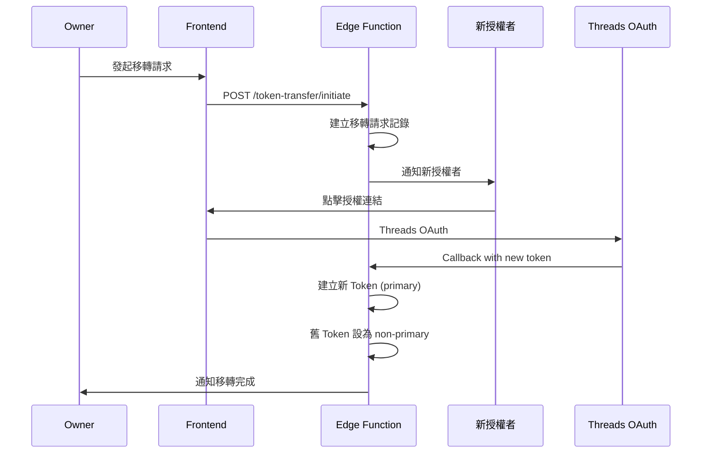

# Token 移轉

## 概述

將 Threads Token 的所有權從一個成員移轉到另一個成員，用於成員離開或交接時。

---

## 流程圖



---

## Edge Function: token-transfer-initiate

### 發起移轉

```typescript
// POST /functions/v1/token-transfer-initiate
serve(async (req) => {
  const { workspace_threads_account_id, target_user_id } = await req.json();
  const { data: { user } } = await supabase.auth.getUser();

  // 驗證權限（必須是 Owner）
  // 權限驗證、寫入 token_transfers（透過 service_role）由後端封裝處理

  // TODO: 發送通知給目標用戶

  return new Response(JSON.stringify({
    transfer_id,
    expires_at,
    threads_oauth_path
  }));
});
```

### 完成移轉（OAuth Callback 後）

```typescript
// 已由 threads-oauth / threads-oauth-callback 實作：
// - threads-oauth 會把 transfer_id 放進簽章 state
// - threads-oauth-callback 會驗證 token_transfers、寫入新 token、撤銷舊 token、刪除 transfer
```

---

## 前端流程

### 發起方（Owner）

```typescript
async function initiateTransfer(accountId: string, targetUserId: string) {
  const response = await fetch('/functions/v1/token-transfer-initiate', {
    method: 'POST',
    headers: { 'Content-Type': 'application/json' },
    body: JSON.stringify({
      workspace_threads_account_id: accountId,
      target_user_id: targetUserId,
    }),
  });

  const { threads_oauth_path } = await response.json();

  // 顯示提示：已發送移轉請求給目標用戶
  // 實際上可把 threads_oauth_path 交給「目標用戶」在其登入狀態下開啟
}
```

### 接收方（新授權者）

```typescript
// pages/transfer/[token].tsx
function TransferPage({ token }) {
  const handleAccept = async () => {
    // 實際流程：
    // - Owner 發起後拿到 threads_oauth_path
    // - 將該 path 傳給 target user（訊息/通知）
    // - target user 在登入狀態下開啟 threads_oauth_path 以完成授權
    window.location.href = token;
  };

  return (
    <div>
      <h1>Token 移轉請求</h1>
      <p>您被邀請接管 Threads 帳號的授權</p>
      <button onClick={handleAccept}>接受並授權</button>
    </div>
  );
}
```

---

## 多 Token 支援

移轉完成後：

| Token | is_primary | 狀態 |
|-------|------------|------|
| 舊 Token | false | 保留但不使用 |
| 新 Token | true | 同步使用此 Token |

舊 Token 可：
- 立即 revoke
- 保留一段時間後再 revoke
- 由 Owner 手動 revoke

---

## 錯誤處理

| 錯誤 | 說明 | 處理 |
|------|------|------|
| Transfer expired | 移轉連結過期 | 重新發起 |
| User not member | 目標不是成員 | 先邀請加入 |
| OAuth failed | Threads 授權失敗 | 重試 |
