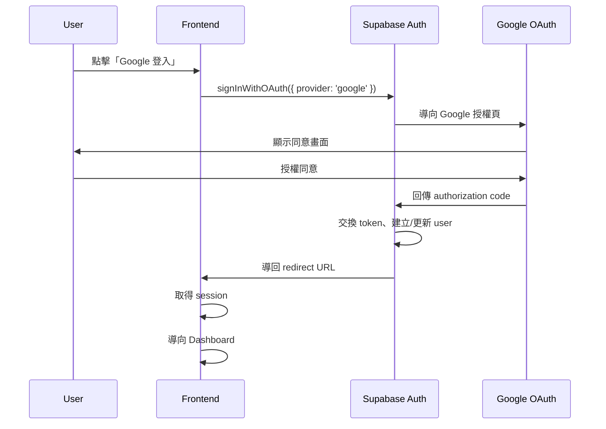

# Google OAuth 流程

## 概述

使用者透過 Google OAuth 登入系統，由 Supabase Auth 處理整個流程。

---

## 流程圖



---

## 前端實作

### 登入按鈕

```typescript
import { createClientComponentClient } from '@supabase/auth-helpers-nextjs';

const supabase = createClientComponentClient();

async function signInWithGoogle() {
  const { error } = await supabase.auth.signInWithOAuth({
    provider: 'google',
    options: {
      redirectTo: `${window.location.origin}/auth/callback`,
      queryParams: {
        access_type: 'offline',
        prompt: 'consent',
      },
    },
  });

  if (error) {
    console.error('Login error:', error);
  }
}
```

### Callback 處理

```typescript
// app/auth/callback/route.ts
import { createRouteHandlerClient } from '@supabase/auth-helpers-nextjs';
import { cookies } from 'next/headers';
import { NextResponse } from 'next/server';

export async function GET(request: Request) {
  const requestUrl = new URL(request.url);
  const code = requestUrl.searchParams.get('code');

  if (code) {
    const supabase = createRouteHandlerClient({ cookies });
    await supabase.auth.exchangeCodeForSession(code);
  }

  // 導回 Dashboard
  return NextResponse.redirect(new URL('/dashboard', requestUrl.origin));
}
```

---

## 首次登入處理

### 自動建立 Workspace

在 callback 後檢查是否首次登入：

```typescript
async function handlePostLogin(userId: string) {
  // 檢查是否有任何 Workspace
  const { data: memberships } = await supabase
    .from('workspace_members')
    .select('workspace_id')
    .eq('user_id', userId)
    .limit(1);

  // 首次登入：建立預設 Workspace
  if (!memberships || memberships.length === 0) {
    await createDefaultWorkspace(userId);
  }
}

async function createDefaultWorkspace(userId: string) {
  const { data: workspace } = await supabase
    .from('workspaces')
    .insert({ name: '我的工作區', created_by_user_id: userId })
    .select()
    .single();

  await supabase
    .from('workspace_members')
    .insert({
      workspace_id: workspace.id,
      user_id: userId,
      role: 'owner',
      joined_at: new Date().toISOString(),
    });
}
```

---

## Supabase 設定

### Dashboard 設定

1. Authentication → Providers → Google
2. 啟用 Google Provider
3. 填入 Client ID 和 Client Secret

### Google Cloud Console 設定

1. APIs & Services → Credentials
2. 建立 OAuth 2.0 Client ID
3. Authorized redirect URIs:
   - `https://<project>.supabase.co/auth/v1/callback`

---

## Session 管理

### 取得當前使用者

```typescript
const { data: { user } } = await supabase.auth.getUser();
```

### 登出

```typescript
await supabase.auth.signOut();
```

### Session 監聽

```typescript
supabase.auth.onAuthStateChange((event, session) => {
  if (event === 'SIGNED_IN') {
    // 登入成功
  }
  if (event === 'SIGNED_OUT') {
    // 已登出
  }
});
```

---

## 錯誤處理

| 錯誤 | 原因 | 處理方式 |
|------|------|----------|
| `invalid_grant` | 授權碼過期 | 重新導向登入 |
| `access_denied` | 使用者拒絕 | 顯示友善訊息 |
| `server_error` | Supabase 錯誤 | 重試或聯繫支援 |
