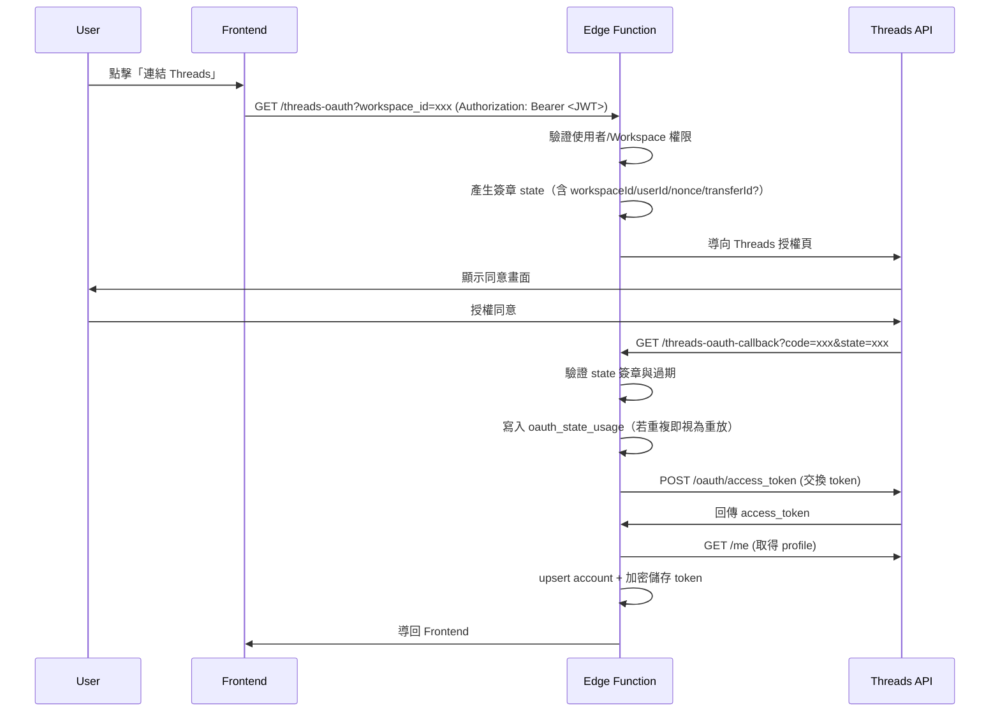

# Threads OAuth 流程

## 概述

使用者在已登入的狀態下，將 Threads 帳號連結到指定 Workspace。後端負責：

- 產生並簽章 `state`（防 CSRF/防竄改）
- 在 callback 端以資料庫記錄 `state` 的「單次使用」（防重放）
- 交換 access token、抓取 Threads profile、加密後寫入資料庫

---

## 流程圖

---

## Edge Function: threads-oauth

### 功能

導向 Threads OAuth 授權頁面（需登入）。

### 介面

- Method: `GET`
- Path: `/threads-oauth`
- Query:
  - `workspace_id`：必填
  - `transfer_id`：選填（Token 移轉流程）
- Headers:
  - `Authorization: Bearer <Supabase JWT>`

### 行為

- 以 `Authorization` 驗證使用者（`createAnonClient` + `getAuthenticatedUser`）。
- 檢查使用者是否為該 Workspace 的 `owner` 或 `editor`（`validateWorkspaceMembership`）。
- 產生 HMAC 簽章 `state`（`signState`），並導向 Threads 授權頁。
- 有基本 rate limit（DB-backed，避免濫用）。

實作位置：`supabase/functions/threads-oauth/index.ts`

---

## Edge Function: threads-oauth-callback

### 功能

處理 OAuth callback，交換並儲存 Token（由 Threads 呼叫，無 JWT）。

### 介面

- Method: `GET`
- Path: `/threads-oauth-callback`
- Query:
  - `code`：必填
  - `state`：必填

### 行為

- 驗證 `state`（`verifyStateDetailed`）：簽章、過期。
- 先寫入 `oauth_state_usage`（primary key 為 `state_hash`）；若插入重複視為重放，直接拒絕。
- 交換 token → 取得 Threads profile → `workspace_threads_accounts` upsert。
- token 以 `ENCRYPTION_SECRET` 加密後寫入 `workspace_threads_tokens`。
- 若 `state` 含 `transferId`，走 Token 移轉流程（驗證 `token_transfers`、寫入 token、刪除 transfer）。
- 最後導回 `FRONTEND_URL/settings`（成功或帶錯誤參數）。

實作位置：`supabase/functions/threads-oauth-callback/index.ts`

---

## Threads API Scope

| Scope | 說明 | 用途 |
|-------|------|------|
| `threads_basic` | 基本存取 | 取得貼文、profile |
| `threads_manage_insights` | 成效數據 | 取得 views, likes 等 |

---

## Token 加密

使用 `AES-GCM` 加密 token，並支援格式版本（v2 帶隨機 salt；v1 為舊格式相容）。

實作位置：`supabase/functions/_shared/crypto.ts`

---

## 錯誤處理

| 錯誤 | 原因 | 處理方式 |
|------|------|----------|
| `invalid_code` | 授權碼已使用 | 重新授權 |
| `invalid_client` | App ID/Secret 錯誤 | 檢查設定 |
| `access_denied` | 使用者拒絕 | 顯示提示訊息 |

---

## 相關環境變數

必要：

- `THREADS_APP_ID`, `THREADS_APP_SECRET`
- `SUPABASE_URL`, `SUPABASE_SERVICE_ROLE_KEY`
- `OAUTH_STATE_SECRET`, `ENCRYPTION_SECRET`
- `FRONTEND_URL`

建議：

- `ALLOWED_ORIGINS`（CORS allowlist）
- `THREADS_USE_AUTH_HEADER=true`（Threads API request 盡量改用 Authorization Header）
