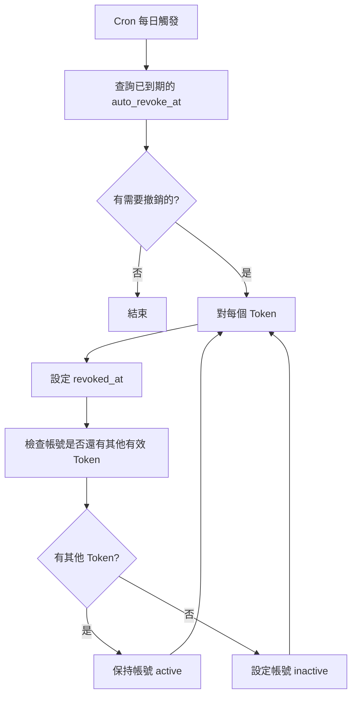

# Token 自動撤銷

## 概述

當成員離開 Workspace 且擁有 Token 時，系統會設定自動撤銷時間。此 Job 執行實際的撤銷操作。

---

## 流程圖



---

## 排程設定

使用 `pg_cron` + `pg_net` 自動觸發：

| 設定 | 值 |
|------|-----|
| Cron 表達式 | `0 3 * * *` |
| 頻率 | 每天 UTC 03:00（台灣時間 11:00） |
| 觸發方式 | `pg_cron` → `trigger_edge_function()` → HTTP POST |

詳細設定請參考：[Cron 排程設定](cron-setup.md)

## 防重複執行

為避免排程重疊/重複觸發，會在 DB 取得 `system_job_locks`（TTL 10 分鐘）。若未取得鎖，會回傳 `skipped=true`。

---

## 實作

```typescript
// supabase/functions/token-auto-revoke/index.ts
serve(async (req) => {
  const supabase = createClient(
    Deno.env.get('SUPABASE_URL')!,
    Deno.env.get('SUPABASE_SERVICE_ROLE_KEY')!
  );

  // 查詢需要自動撤銷的 Token
  const { data: tokens } = await supabase
    .from('workspace_threads_tokens')
    .select(`
      id,
      workspace_threads_account_id,
      authorized_by_user_id
    `)
    .not('auto_revoke_at', 'is', null)
    .lt('auto_revoke_at', new Date().toISOString())
    .is('revoked_at', null);

  const results = [];

  for (const token of tokens || []) {
    try {
      // 1. 撤銷 Token
      await supabase
        .from('workspace_threads_tokens')
        .update({ revoked_at: new Date().toISOString() })
        .eq('id', token.id);

      // 2. 檢查帳號是否還有其他有效 Token
      const { data: otherTokens } = await supabase
        .from('workspace_threads_tokens')
        .select('id')
        .eq('workspace_threads_account_id', token.workspace_threads_account_id)
        .is('revoked_at', null)
        .neq('id', token.id);

      // 3. 如果沒有其他有效 Token，設定帳號為 inactive
      if (!otherTokens || otherTokens.length === 0) {
        await supabase
          .from('workspace_threads_accounts')
          .update({ is_active: false })
          .eq('id', token.workspace_threads_account_id);

        results.push({
          tokenId: token.id,
          status: 'revoked',
          accountInactive: true,
        });
      } else {
        results.push({
          tokenId: token.id,
          status: 'revoked',
          accountInactive: false,
        });
      }

    } catch (error) {
      results.push({
        tokenId: token.id,
        status: 'failed',
        error: error.message,
      });
    }
  }

  return new Response(JSON.stringify({ results }));
});
```

---

## 觸發時機

### 成員離開時設定

`auto_revoke_at` 的設定由 Edge Function 封裝處理：

- `POST /functions/v1/workspace-member-remove`（Owner 移除成員時）
- 會自動把該成員在此 workspace 相關 token 的 `auto_revoke_at` 設為 `NOW() + 7 days`

---

## 提前處理（移轉）

若在自動撤銷期限內完成 Token 移轉，授權流程會由 `threads-oauth-callback` 更新 token 狀態並清理 `token_transfers`，不需要 client 端直接操作 token 表。

---

## 自動撤銷期限

| 情況 | 預設期限 |
|------|----------|
| 成員離開 | 7 天 |
| 成員被移除 | 7 天 |

可透過環境變數設定：

```bash
AUTO_REVOKE_DAYS=7
```

---

## 通知機制

雖然不發送同步失敗通知，但可發送移轉提醒：

1. 成員離開時：發送提醒給 Owner
2. 距離自動撤銷 3 天時：再次提醒
3. 自動撤銷後：通知 Owner 帳號已停止同步
