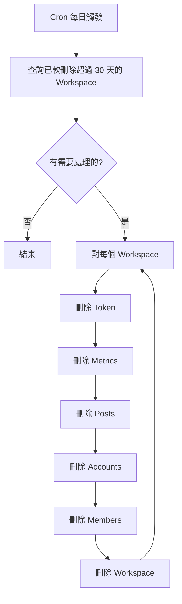

# Workspace 刪除任務

## 概述

處理 Workspace 軟刪除後的清理工作，30 天後永久刪除。

---

## 流程圖



---

## 排程設定

使用 `pg_cron` + `pg_net` 自動觸發：

| 設定 | 值 |
|------|-----|
| Cron 表達式 | `0 4 * * *` |
| 頻率 | 每天 UTC 04:00（台灣時間 12:00） |
| 觸發方式 | `pg_cron` → `trigger_edge_function()` → HTTP POST |

詳細設定請參考：[Cron 排程設定](cron-setup.md)

---

## 實作

實作位置：`supabase/functions/workspace-cleanup/index.ts`

重點行為：

- 永久刪除 `deleted_at` 超過 30 天的 Workspace（依 FK cascade 清理關聯資料）
- 清理系統表避免無限增長（`oauth_state_usage`、`rate_limit_counters`、`sync_logs`、`system_job_logs`、`system_job_locks`）
- 使用 DB-backed `system_job_locks` 避免排程重疊執行

---

## 刪除順序

依照外鍵關係，由內而外刪除：

1. `workspace_threads_tokens`
2. `workspace_threads_post_metrics`
3. `workspace_threads_posts`
4. `workspace_threads_account_insights`
5. `sync_logs`
6. `workspace_threads_accounts`
7. `workspace_members`
8. `workspaces`

---

## 取消刪除

在 30 天內可取消：

```typescript
async function cancelDeletion(workspaceId: string) {
  await supabase
    .from('workspaces')
    .update({
      deleted_at: null,
      deletion_confirmed_by: [],
    })
    .eq('id', workspaceId);
}
```

---

## 注意事項

1. **不可逆**：30 天後永久刪除，無法恢復
2. **級聯刪除**：所有關聯資料一併刪除
3. **防重複執行**：排程任務有 lock，重疊觸發時會回傳 `skipped=true`
