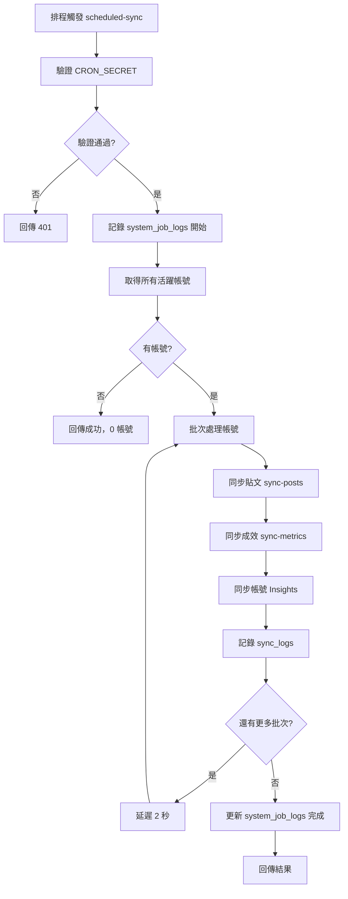

# 排程同步主流程

## 概述

由排程器觸發，執行所有活躍帳號的完整資料同步。採用三層式資料架構確保資料完整性。

## 排程設定

使用 `pg_cron` + `pg_net` 自動觸發：

| 設定 | 值 |
|------|-----|
| Cron 表達式 | `0,15,30,45 * * * *` |
| 頻率 | 每 15 分鐘 |
| 觸發方式 | `pg_cron` → `trigger_edge_function()` → HTTP POST |

詳細設定請參考：[Cron 排程設定](../jobs/cron-setup.md)

---

## 流程圖



---

## Edge Function: scheduled-sync

### 端點

```
POST /functions/v1/scheduled-sync
Headers: Authorization: Bearer <CRON_SECRET>
```

### 驗證機制

使用 `CRON_SECRET` 環境變數驗證，確保只有授權的排程器可以觸發。

### 防重複執行

為避免排程重疊/重複觸發，會在 DB 取得 `system_job_locks`（TTL 30 分鐘）。若未取得鎖，會回傳 `skipped=true`。

### 批次處理

| 設定 | 值 | 說明 |
|------|-----|------|
| `BATCH_SIZE` | 5 | 每批處理帳號數 |
| `BATCH_DELAY_MS` | 2000 | 批次間延遲（毫秒） |

### 實作

```typescript
// supabase/functions/scheduled-sync/index.ts
import { handleCors } from '../_shared/cors.ts';
import { createServiceClient } from '../_shared/supabase.ts';
import { decrypt } from '../_shared/crypto.ts';
import { ThreadsApiClient } from '../_shared/threads-api.ts';
import {
  syncPostsForAccount,
  syncMetricsForAccount,
  syncAccountInsightsForAccount,
} from '../_shared/sync.ts';

const CRON_SECRET = Deno.env.get('CRON_SECRET');

Deno.serve(async (req) => {
  // 驗證 CRON_SECRET
  const authHeader = req.headers.get('Authorization');
  const token = authHeader?.replace('Bearer ', '');

  if (!CRON_SECRET || token !== CRON_SECRET) {
    return new Response('Unauthorized', { status: 401 });
  }

  const serviceClient = createServiceClient();

  // 記錄同步開始（系統層級）
  const { data: jobLog } = await serviceClient
    .from('system_job_logs')
    .insert({
      job_type: 'scheduled_sync',
      status: 'running',
    })
    .select()
    .single();

  // 取得所有活躍帳號
  const { data: accounts } = await serviceClient
    .from('workspace_threads_accounts')
    .select(`
      id, username,
      workspace_threads_tokens!inner (
        access_token_encrypted,
        expires_at
      )
    `)
    .eq('is_active', true)
    .eq('workspace_threads_tokens.is_primary', true)
    .is('workspace_threads_tokens.revoked_at', null)
    .gt('workspace_threads_tokens.expires_at', new Date().toISOString());

  // 批次處理每個帳號
  for (const account of accounts) {
    const accessToken = await decrypt(account.workspace_threads_tokens[0].access_token_encrypted);
    const threadsClient = new ThreadsApiClient(accessToken);

    // 使用共用同步模組（確保一致性）
    await syncPostsForAccount(serviceClient, account.id, threadsClient);
    await syncMetricsForAccount(serviceClient, account.id, threadsClient, now);
    await syncAccountInsightsForAccount(serviceClient, account.id, threadsClient, now);

    // 記錄帳號層級同步到 sync_logs
    await serviceClient.from('sync_logs').insert({
      workspace_threads_account_id: account.id,
      job_type: 'scheduled_sync',
      status: 'completed',
      completed_at: new Date().toISOString(),
    });
  }

  // 更新系統任務日誌
  await serviceClient
    .from('system_job_logs')
    .update({
      status: 'completed',
      completed_at: new Date().toISOString(),
      metadata: { success_count, error_count },
    })
    .eq('id', jobLog?.id);

  return new Response(JSON.stringify({ results }));
});
```

---

## 同步順序

| 順序 | 步驟 | 說明 |
|------|------|------|
| 1 | `syncPostsForAccount` | 先同步貼文（後續需要 post ID） |
| 2 | `syncMetricsForAccount` | 同步各貼文成效（三層式） |
| 3 | `syncAccountInsightsForAccount` | 同步帳號層級數據（三層式） |

---

## 共用同步模組

為確保手動同步與排程同步行為一致，所有同步邏輯集中在 `_shared/sync.ts`：

| 函式 | 說明 |
|------|------|
| `syncPostsForAccount` | 同步貼文列表 |
| `syncMetricsForAccount` | 三層式成效同步（Snapshot → Delta → Current） |
| `syncAccountInsightsForAccount` | 三層式帳號 Insights 同步 |

---

## 日誌機制

### 系統層級 (system_job_logs)

記錄整體排程任務狀態，不綁定特定帳號。

| 欄位 | 說明 |
|------|------|
| `job_type` | `'scheduled_sync'` |
| `status` | `'running'` / `'completed'` / `'partial'` / `'failed'` |
| `metadata` | 包含 total_accounts, success_count, error_count |

### 帳號層級 (sync_logs)

每個帳號同步完成後記錄。

| 欄位 | 說明 |
|------|------|
| `workspace_threads_account_id` | 帳號 ID |
| `job_type` | `'sync_posts'` / `'sync_metrics'` / `'sync_account_insights'` |
| `status` | `'completed'` / `'partial'` / `'failed'` |

---

## 三層式資料架構

同步時使用三層式架構處理成效資料：

| Layer | 資料表 | 說明 |
|-------|--------|------|
| L1 Snapshot | `workspace_threads_post_metrics` | 不可變的快照記錄 |
| L2 Delta | `workspace_threads_post_metrics_deltas` | 計算增量變化 |
| L3 Current | `workspace_threads_posts.current_*` | 快速查詢用的當前值 |

---

## 錯誤處理策略

| 情況 | 處理方式 |
|------|----------|
| Token 過期 | 跳過，等待 token-refresh 處理 |
| API 錯誤 | 記錄 log，繼續下一帳號 |
| Rate Limit | 記錄 log，下次重試 |
| 部分失敗 | 狀態設為 `partial`，記錄已完成步驟 |

---

## 效能考量

1. **批次處理**：每批 5 個帳號並行處理
2. **批次延遲**：批次間延遲 2 秒，避免 Rate Limit
3. **超時保護**：Edge Function 預設 60 秒超時
