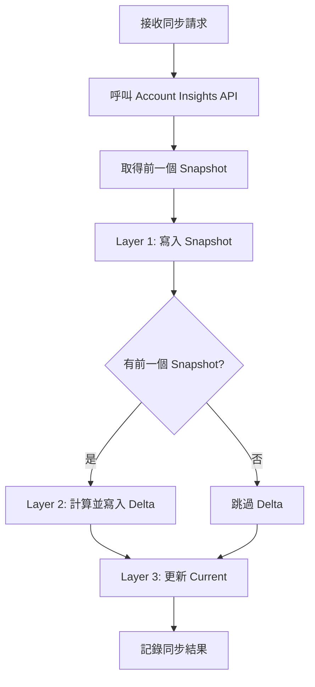

# 同步帳號 Insights

## 概述

取得 Threads 帳號層級的 Insights（粉絲數、觀看數、7天互動等），採用**三層式寫入架構**。

**同步頻率：每 15 分鐘（每小時 00/15/30/45）**

---

## 三層式寫入架構

```
Threads API 回傳數據
        ↓
┌─────────────────────────────────────────────────────────┐
│ Step 1: 取得前一個 Snapshot                              │
│ → 用於計算 Delta                                        │
├─────────────────────────────────────────────────────────┤
│ Step 2: Layer 1 — 寫入 Snapshot                         │
│ → workspace_threads_account_insights                   │
│ → INSERT（不可變）                                       │
├─────────────────────────────────────────────────────────┤
│ Step 3: Layer 2 — 計算並寫入 Delta                      │
│ → workspace_threads_account_insights_deltas            │
│ → calculateDelta(current, previous)                     │
├─────────────────────────────────────────────────────────┤
│ Step 4: Layer 3 — 更新 Current                          │
│ → workspace_threads_accounts.current_*                 │
│ → UPDATE 最新值                                         │
└─────────────────────────────────────────────────────────┘
```

---

## 流程圖



---

## Threads API

### 端點

```
GET /me/threads_insights
```

### 參數

| 參數 | 類型 | 說明 |
|------|------|------|
| metric | string | 要取得的指標（逗號分隔） |

### 可用指標

| 指標 | 說明 |
|------|------|
| followers_count | 粉絲數 |
| profile_views | Profile 觀看數 |
| likes | 7 天按讚數 |
| views | 7 天觀看數 |
| follower_demographics | 受眾輪廓（需額外權限） |

### 回應範例

```json
{
  "data": [
    { "name": "followers_count", "values": [{ "value": 12345 }] },
    { "name": "profile_views", "values": [{ "value": 5678 }] },
    { "name": "likes", "values": [{ "value": 890 }] },
    { "name": "views", "values": [{ "value": 45000 }] },
    {
      "name": "follower_demographics",
      "values": [{
        "value": {
          "gender": { "male": 45.2, "female": 52.8, "other": 2.0 },
          "age": { "18-24": 25.0, "25-34": 40.0, "35-44": 20.0 },
          "country": { "TW": 60.0, "US": 15.0, "JP": 10.0 }
        }
      }]
    }
  ]
}
```

---

## 實作

```typescript
// 同步帳號 Insights 核心邏輯（三層式寫入）
async function syncAccountInsights(
  supabase: SupabaseClient,
  account: ThreadsAccount,
  token: ThreadsToken
) {
  const accessToken = await decrypt(token.access_token_encrypted);
  const now = new Date().toISOString();

  // ========================================
  // 1. Fetch insights from Threads API
  // ========================================
  const url = new URL('https://graph.threads.net/v1.0/me/threads_insights');
  url.searchParams.set('metric', 'followers_count,profile_views,likes,views,follower_demographics');
  url.searchParams.set('access_token', accessToken);

  const response = await fetch(url);
  const data = await response.json();

  if (data.error) {
    throw new Error(data.error.message);
  }

  const insights = parseInsightsResponse(data.data);

  // ========================================
  // 2. Get previous snapshot (for delta)
  // ========================================
  const { data: prevSnapshot } = await supabase
    .from('workspace_threads_account_insights')
    .select('*')
    .eq('workspace_threads_account_id', account.id)
    .order('captured_at', { ascending: false })
    .limit(1)
    .single();

  // ========================================
  // 3. Layer 1: Write Snapshot (不可變)
  // ========================================
  await supabase
    .from('workspace_threads_account_insights')
    .insert({
      workspace_threads_account_id: account.id,
      followers_count: insights.followers_count || 0,
      profile_views: insights.profile_views || 0,
      likes_count_7d: insights.likes || 0,
      views_count_7d: insights.views || 0,
      demographics: insights.follower_demographics || null,
      captured_at: now,
    });

  // ========================================
  // 4. Layer 2: Calculate & Write Delta
  // ========================================
  if (prevSnapshot) {
    await supabase
      .from('workspace_threads_account_insights_deltas')
      .insert({
        workspace_threads_account_id: account.id,
        period_start: prevSnapshot.captured_at,
        period_end: now,
        followers_delta: (insights.followers_count || 0) - prevSnapshot.followers_count,
        profile_views_delta: (insights.profile_views || 0) - prevSnapshot.profile_views,
        likes_count_7d_delta: (insights.likes || 0) - prevSnapshot.likes_count_7d,
        views_count_7d_delta: (insights.views || 0) - prevSnapshot.views_count_7d,
        is_recalculated: false,
      });
  }

  // ========================================
  // 5. Layer 3: Update Current
  // ========================================
  await supabase
    .from('workspace_threads_accounts')
    .update({
      current_followers_count: insights.followers_count || 0,
      current_profile_views: insights.profile_views || 0,
      current_likes_count_7d: insights.likes || 0,
      current_views_count_7d: insights.views || 0,
      last_insights_sync_at: now,
    })
    .eq('id', account.id);

  return {
    followers_count: insights.followers_count,
    profile_views: insights.profile_views,
  };
}

// 解析 Insights 回應
function parseInsightsResponse(data: any[]): Record<string, any> {
  const result: Record<string, any> = {};
  for (const item of data) {
    result[item.name] = item.values?.[0]?.value;
  }
  return result;
}
```

---

## 三層各層職責

| Layer | 表 | 操作 | 用途 |
|-------|-----|------|------|
| Layer 1 | `workspace_threads_account_insights` | INSERT | 歷史快照、趨勢圖 |
| Layer 2 | `workspace_threads_account_insights_deltas` | INSERT | 成長分析、區間統計 |
| Layer 3 | `workspace_threads_accounts.current_*` | UPDATE | 列表顯示、Dashboard |

---

## 儲存策略

| 策略 | 說明 |
|------|------|
| **Layer 1 不可變** | Snapshot 只 INSERT，永不 UPDATE |
| **Layer 2 可重算** | 若 Snapshot 資料正確，Delta 可從 L1 重算 |
| **Layer 3 可覆寫** | 每次同步更新最新值 |

---

## Demographics 結構

```typescript
interface Demographics {
  gender: {
    male: number;
    female: number;
    other: number;
  };
  age: {
    '13-17': number;
    '18-24': number;
    '25-34': number;
    '35-44': number;
    '45-54': number;
    '55-64': number;
    '65+': number;
  };
  country: Record<string, number>;
  city?: Record<string, number>;
}
```

---

## 權限需求

| 指標 | 需要權限 |
|------|----------|
| followers_count | threads_basic |
| profile_views | threads_basic |
| likes | threads_basic |
| views | threads_basic |
| follower_demographics | threads_manage_insights |

---

## 同步頻率

| 頻率 | 說明 |
|------|------|
| **每 15 分鐘（每小時 00/15/30/45）** | 與貼文成效同步一致 |

---

## 使用場景

### 粉絲成長趨勢（從 Delta）

```sql
SELECT
  DATE(period_end) as date,
  SUM(followers_delta) as growth
FROM workspace_threads_account_insights_deltas
WHERE workspace_threads_account_id = $1
  AND period_end >= NOW() - INTERVAL '30 days'
GROUP BY DATE(period_end)
ORDER BY date;
```

### Dashboard 快速查詢（從 Current）

```sql
SELECT
  username,
  current_followers_count,
  current_profile_views,
  current_likes_count_7d,
  last_insights_sync_at
FROM workspace_threads_accounts
WHERE workspace_id = $1;
```
