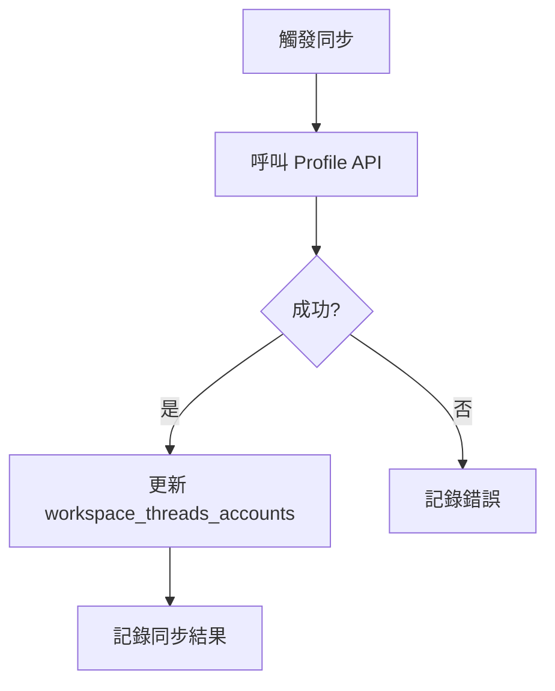

# 同步帳號 Profile

## 概述

取得 Threads 帳號的基本資料（username、name、頭貼等），更新到 `workspace_threads_accounts` 表。

此功能獨立於 `sync-account-insights`，僅在需要時觸發。

---

## 觸發時機

| 時機 | 說明 |
|------|------|
| OAuth 完成後 | 首次取得帳號資料 |
| 手動觸發 | 用戶在設定頁面點擊「更新資料」 |
| Token 刷新後 | 確認帳號狀態正常 |

---

## 流程圖



---

## Threads API

### 端點

```
GET /me?fields=id,username,name,threads_biography,threads_profile_picture_url,is_verified
```

### 回應範例

```json
{
  "id": "1234567890",
  "username": "example_user",
  "name": "Example User",
  "threads_biography": "Hello, I'm on Threads!",
  "threads_profile_picture_url": "https://...",
  "is_verified": false
}
```

---

## 實作

```typescript
// 同步帳號 Profile 核心邏輯
async function syncAccountProfile(
  supabase: SupabaseClient,
  account: ThreadsAccount,
  token: ThreadsToken
) {
  const accessToken = await decrypt(token.access_token_encrypted);

  // 呼叫 Profile API
  const fields = 'id,username,name,threads_biography,threads_profile_picture_url,is_verified';
  const url = new URL('https://graph.threads.net/v1.0/me');
  url.searchParams.set('fields', fields);
  url.searchParams.set('access_token', accessToken);

  const response = await fetch(url);
  const profile = await response.json();

  if (profile.error) {
    throw new Error(profile.error.message);
  }

  // 更新 workspace_threads_accounts
  const { error } = await supabase
    .from('workspace_threads_accounts')
    .update({
      username: profile.username,
      name: profile.name,
      biography: profile.threads_biography,
      profile_pic_url: profile.threads_profile_picture_url,
      is_verified: profile.is_verified || false,
      updated_at: new Date().toISOString(),
    })
    .eq('id', account.id);

  if (error) throw error;

  return {
    username: profile.username,
    name: profile.name,
    is_verified: profile.is_verified,
  };
}
```

---

## 更新欄位

| API 欄位 | 資料庫欄位 | 說明 |
|----------|------------|------|
| username | username | 用戶名稱 |
| name | name | 顯示名稱 |
| threads_biography | biography | 個人簡介 |
| threads_profile_picture_url | profile_pic_url | 頭像 URL |
| is_verified | is_verified | 是否已驗證 |

---

## 權限需求

| 權限 | 說明 |
|------|------|
| threads_basic | 基本 Profile 資訊 |

---

## 與 OAuth Callback 整合

OAuth 完成後自動觸發 Profile 同步：

```typescript
// threads-oauth-callback/index.ts
async function handleOAuthCallback(code: string) {
  // 1. Exchange token
  const token = await exchangeToken(code);

  // 2. Get profile (for initial data)
  const profile = await fetchProfile(token.access_token);

  // 3. Create/Update account record
  await upsertAccount(profile, token);

  // 4. Profile 已在步驟 2-3 同步，無需再呼叫 sync-account-profile
}
```

---

## 注意事項

1. **不定期同步**：Profile 變動頻率低，不需排程
2. **手動觸發**：用戶可在設定頁面手動更新
3. **錯誤容忍**：Profile 取得失敗不影響其他功能
