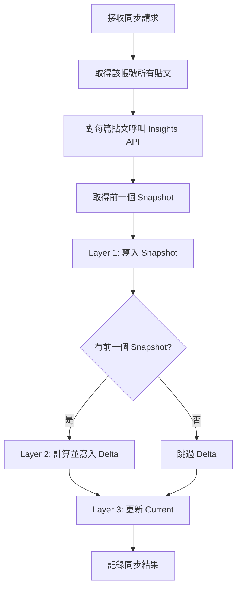

# 同步成效數據

## 概述

取得每篇貼文的成效指標（views, likes 等），採用 **三層式寫入架構**。

---

## 三層式寫入架構

```
Threads API 回傳數據
        ↓
┌─────────────────────────────────────────────────────────┐
│ Step 1: 取得前一個 Snapshot                              │
│ → 用於計算 Delta                                        │
├─────────────────────────────────────────────────────────┤
│ Step 2: Layer 1 — 寫入 Snapshot                         │
│ → workspace_threads_post_metrics                        │
│ → INSERT（不可變）                                       │
├─────────────────────────────────────────────────────────┤
│ Step 3: Layer 2 — 計算並寫入 Delta                      │
│ → workspace_threads_post_metrics_deltas                 │
│ → calculateDelta(current, previous)                     │
├─────────────────────────────────────────────────────────┤
│ Step 4: Layer 3 — 更新 Current                          │
│ → workspace_threads_posts.current_*                     │
│ → UPDATE 最新值                                         │
└─────────────────────────────────────────────────────────┘
```

---

## 流程圖



---

## Threads API

### 端點

```
GET /{post_id}/insights
```

### 可用指標

| 指標 | 說明 |
|------|------|
| views | 觀看次數 |
| likes | 按讚數 |
| replies | 回覆數 |
| reposts | 轉發數 |
| quotes | 引用數 |
| shares | 分享數 |

---

## 實作

```typescript
// 同步成效核心邏輯（三層式寫入）
async function syncMetrics(
  supabase: SupabaseClient,
  account: ThreadsAccount,
  token: ThreadsToken
) {
  const accessToken = await decrypt(token.access_token_encrypted);
  const now = new Date().toISOString();

  // 取得該帳號所有貼文
  const { data: posts } = await supabase
    .from('workspace_threads_posts')
    .select('id, threads_post_id')
    .eq('workspace_threads_account_id', account.id);

  for (const post of posts || []) {
    try {
      // ========================================
      // 1. Fetch metrics from Threads API
      // ========================================
      const metrics = await fetchInsights(post.threads_post_id, accessToken);

      // ========================================
      // 2. Get previous snapshot (for delta)
      // ========================================
      const { data: prevSnapshot } = await supabase
        .from('workspace_threads_post_metrics')
        .select('*')
        .eq('workspace_threads_post_id', post.id)
        .order('captured_at', { ascending: false })
        .limit(1)
        .single();

      // ========================================
      // 3. Layer 1: Write Snapshot (不可變)
      // ========================================
      await supabase
        .from('workspace_threads_post_metrics')
        .insert({
          workspace_threads_post_id: post.id,
          views: metrics.views,
          likes: metrics.likes,
          replies: metrics.replies,
          reposts: metrics.reposts,
          quotes: metrics.quotes,
          shares: metrics.shares,
          captured_at: now,
        });

      // ========================================
      // 4. Layer 2: Calculate & Write Delta
      // ========================================
      if (prevSnapshot) {
        const delta = calculateDelta(metrics, prevSnapshot, now);
        await supabase
          .from('workspace_threads_post_metrics_deltas')
          .insert({
            workspace_threads_post_id: post.id,
            period_start: prevSnapshot.captured_at,
            period_end: now,
            views_delta: delta.views,
            likes_delta: delta.likes,
            replies_delta: delta.replies,
            reposts_delta: delta.reposts,
            quotes_delta: delta.quotes,
            shares_delta: delta.shares,
            is_recalculated: false,
          });
      }

      // ========================================
      // 5. Layer 3: Update Current
      // ========================================
      const viralityScore = calculateViralityScore(metrics);
      await supabase
        .from('workspace_threads_posts')
        .update({
          current_views: metrics.views,
          current_likes: metrics.likes,
          current_replies: metrics.replies,
          current_reposts: metrics.reposts,
          current_quotes: metrics.quotes,
          current_shares: metrics.shares,
          virality_score: viralityScore,
          last_metrics_sync_at: now,
        })
        .eq('id', post.id);

    } catch (error) {
      console.error(`Failed to sync metrics for post ${post.id}:`, error);
    }
  }
}

// Delta 計算
function calculateDelta(
  current: Metrics,
  previous: Metrics,
  now: string
) {
  return {
    views: current.views - previous.views,
    likes: current.likes - previous.likes,
    replies: current.replies - previous.replies,
    reposts: current.reposts - previous.reposts,
    quotes: current.quotes - previous.quotes,
    shares: current.shares - previous.shares,
  };
}

// Virality Score 計算
function calculateViralityScore(metrics: Metrics): number {
  const { views, likes, replies, reposts, quotes, shares } = metrics;
  const spreadScore = (reposts * 3) + (quotes * 2.5) + (shares * 3);
  const engagementScore = likes + (replies * 1.5);

  if (views === 0) return 0;

  const rawScore = ((spreadScore * 2) + engagementScore) / views * 100;
  return Math.round(rawScore * 100) / 100;
}
```

---

## 三層各層職責

| Layer | 表 | 操作 | 用途 |
|-------|-----|------|------|
| Layer 1 | `workspace_threads_post_metrics` | INSERT | 歷史快照、趨勢圖 |
| Layer 2 | `workspace_threads_post_metrics_deltas` | INSERT | 成長分析、區間統計 |
| Layer 3 | `workspace_threads_posts.current_*` | UPDATE | 列表顯示、排序 |

---

## 儲存策略

| 策略 | 說明 |
|------|------|
| **Layer 1 不可變** | Snapshot 只 INSERT，永不 UPDATE |
| **Layer 2 可重算** | 若 Snapshot 資料正確，Delta 可從 L1 重算 |
| **Layer 3 可覆寫** | 每次同步更新最新值 |

---

## Rate Limit 處理

```typescript
// 批次處理，避免過快
async function syncMetricsWithRateLimit(posts: Post[]) {
  const BATCH_SIZE = 10;
  const DELAY_MS = 1000;

  for (let i = 0; i < posts.length; i += BATCH_SIZE) {
    const batch = posts.slice(i, i + BATCH_SIZE);

    await Promise.all(batch.map(post => processPost(post)));

    // 批次間延遲
    if (i + BATCH_SIZE < posts.length) {
      await new Promise(resolve => setTimeout(resolve, DELAY_MS));
    }
  }
}
```

---

## 效能優化

1. **批次處理**：每批 10 篇，間隔 1 秒
2. **並行請求**：同批次內並行
3. **錯誤容忍**：單篇失敗不影響其他
4. **增量更新**：（未來）只取近期貼文的成效
