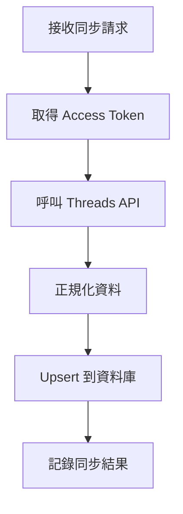

# 同步貼文

## 概述

從 Threads API 拉取帳號的所有貼文，存入資料庫。

---

## 流程圖



---

## Threads API

### 端點

```
GET /me/threads
```

### 參數

| 參數 | 類型 | 說明 |
|------|------|------|
| fields | string | 要取得的欄位 |
| limit | number | 每頁筆數（預設 25，最大 100） |
| after | string | 分頁 cursor |

### 回應範例

```json
{
  "data": [
    {
      "id": "123456789",
      "text": "Hello Threads!",
      "media_type": "TEXT_POST",
      "permalink": "https://threads.net/...",
      "timestamp": "2024-01-15T10:30:00+0000"
    }
  ],
  "paging": {
    "cursors": {
      "after": "xxx"
    }
  }
}
```

---

## 實作

```typescript
// 同步貼文核心邏輯
async function syncPosts(
  supabase: SupabaseClient,
  account: ThreadsAccount,
  token: ThreadsToken
) {
  const accessToken = await decrypt(token.access_token_encrypted);
  const posts = [];
  let cursor = null;

  // 分頁取得所有貼文
  do {
    const url = new URL('https://graph.threads.net/v1.0/me/threads');
    url.searchParams.set('fields', 'id,text,media_type,media_url,permalink,timestamp');
    url.searchParams.set('limit', '100');
    url.searchParams.set('access_token', accessToken);
    if (cursor) {
      url.searchParams.set('after', cursor);
    }

    const response = await fetch(url);
    const data = await response.json();

    if (data.error) {
      throw new Error(data.error.message);
    }

    posts.push(...data.data);
    cursor = data.paging?.cursors?.after;

  } while (cursor);

  // 正規化並寫入資料庫
  const normalizedPosts = posts.map(post => ({
    workspace_threads_account_id: account.id,
    threads_post_id: post.id,
    text: post.text,
    media_type: post.media_type,
    media_url: post.media_url,
    permalink: post.permalink,
    published_at: new Date(post.timestamp).toISOString(),
    updated_at: new Date().toISOString(),
  }));

  // Upsert（有則更新，無則新增）
  const { error } = await supabase
    .from('workspace_threads_posts')
    .upsert(normalizedPosts, {
      onConflict: 'workspace_threads_account_id,threads_post_id',
    });

  if (error) throw error;

  return { synced: normalizedPosts.length };
}
```

---

## 欄位對應

| API 欄位 | DB 欄位 |
|----------|---------|
| id | threads_post_id |
| text | text |
| media_type | media_type |
| media_url | media_url |
| permalink | permalink |
| timestamp | published_at |

---

## Media Type

| API 值 | 說明 |
|--------|------|
| TEXT_POST | 純文字 |
| IMAGE | 圖片 |
| VIDEO | 影片 |
| CAROUSEL_ALBUM | 輪播 |

---

## 同步策略

| 策略 | 說明 |
|------|------|
| 全量同步 | 每次取得所有貼文 |
| Upsert | 有則更新，無則新增 |
| 不刪除 | API 不回傳的貼文保留在 DB |

---

## 效能優化

1. **分頁取得**：使用 cursor 分頁，避免單次取太多
2. **批次寫入**：整批 upsert 而非逐筆
3. **增量同步**：（未來）可記錄 latest_timestamp，只取新貼文
