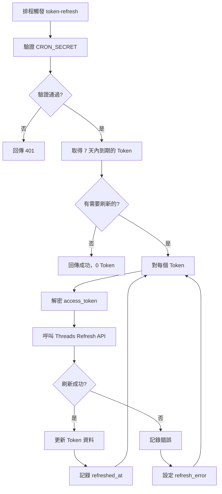

# Token 刷新機制

## 概述

由排程器每日觸發，檢查即將過期的 Token 並自動刷新，維持帳號同步能力。

## 排程設定

使用 `pg_cron` + `pg_net` 自動觸發：

| 設定 | 值 |
|------|-----|
| Cron 表達式 | `0 2 * * *` |
| 頻率 | 每天 UTC 02:00（台灣時間 10:00） |
| 觸發方式 | `pg_cron` → `trigger_edge_function()` → HTTP POST |

詳細設定請參考：[Cron 排程設定](../jobs/cron-setup.md)

---

## 流程圖



---

## Edge Function: token-refresh

### 端點

```
POST /functions/v1/token-refresh
Headers: Authorization: Bearer <CRON_SECRET>
```

### 驗證機制

使用 `CRON_SECRET` 環境變數驗證，確保只有授權的排程器可以觸發。

### 防重複執行

為避免排程重疊/重複觸發，會在 DB 取得 `system_job_locks`（TTL 30 分鐘）。若未取得鎖，會回傳 `skipped=true`。

### 實作

```typescript
// supabase/functions/token-refresh/index.ts
import { handleCors } from '../_shared/cors.ts';
import { createServiceClient } from '../_shared/supabase.ts';
import { encrypt, decrypt } from '../_shared/crypto.ts';
import { ThreadsApiClient } from '../_shared/threads-api.ts';

const CRON_SECRET = Deno.env.get('CRON_SECRET');
const REFRESH_THRESHOLD_DAYS = 7;

Deno.serve(async (req) => {
  // 驗證 CRON_SECRET
  const authHeader = req.headers.get('Authorization');
  const token = authHeader?.replace('Bearer ', '');

  if (!CRON_SECRET || token !== CRON_SECRET) {
    return new Response('Unauthorized', { status: 401 });
  }

  const serviceClient = createServiceClient();
  const now = new Date();
  const thresholdDate = new Date(now.getTime() + REFRESH_THRESHOLD_DAYS * 24 * 60 * 60 * 1000);

  // 取得即將過期的 Token（尚未過期，但在 7 天內會過期）
  const { data: tokens } = await serviceClient
    .from('workspace_threads_tokens')
    .select(`
      id,
      access_token_encrypted,
      expires_at,
      workspace_threads_account_id,
      workspace_threads_accounts!inner (
        id, username
      )
    `)
    .eq('is_primary', true)
    .is('revoked_at', null)
    .gt('expires_at', now.toISOString())
    .lt('expires_at', thresholdDate.toISOString());

  for (const tokenRecord of tokens) {
    try {
      const accessToken = await decrypt(tokenRecord.access_token_encrypted);

      // 使用 Threads API 刷新 Token
      const newTokenData = await ThreadsApiClient.refreshLongLivedToken(accessToken);

      // 更新 Token
      await serviceClient
        .from('workspace_threads_tokens')
        .update({
          access_token_encrypted: await encrypt(newTokenData.access_token),
          expires_at: new Date(now.getTime() + newTokenData.expires_in * 1000).toISOString(),
          refreshed_at: now.toISOString(),
        })
        .eq('id', tokenRecord.id);

    } catch (error) {
      // 記錄錯誤
      await serviceClient
        .from('workspace_threads_tokens')
        .update({
          refresh_error: error.message,
          refresh_error_at: now.toISOString(),
        })
        .eq('id', tokenRecord.id);
    }
  }

  return new Response(JSON.stringify({ refreshed_count: successCount }));
});
```

---

## Token 追蹤欄位

`workspace_threads_tokens` 資料表包含以下追蹤欄位：

| 欄位 | 類型 | 說明 |
|------|------|------|
| `refreshed_at` | TIMESTAMPTZ | 上次成功刷新時間 |
| `refresh_error` | TEXT | 刷新失敗錯誤訊息 |
| `refresh_error_at` | TIMESTAMPTZ | 刷新失敗時間 |

---

## Threads Token 類型

| 類型 | 有效期 | 刷新方式 |
|------|--------|----------|
| Short-Lived | 1 小時 | 需交換成 Long-Lived |
| Long-Lived | 60 天 | 使用 `refresh_access_token` API |

---

## 刷新時機

| 條件 | 動作 |
|------|------|
| 距離過期 > 7 天 | 不處理 |
| 距離過期 ≤ 7 天且未過期 | 刷新 |
| 已過期 | 由 `token-auto-revoke` 處理 |

---

## Threads Refresh API

```
GET https://graph.threads.net/refresh_access_token
  ?grant_type=th_refresh_token
  &access_token={long-lived-token}
```

回應：

```json
{
  "access_token": "new_long_lived_token",
  "token_type": "bearer",
  "expires_in": 5184000
}
```

---

## 錯誤處理

| 錯誤碼 | 說明 | 處理方式 |
|--------|------|----------|
| 190 | Invalid access token | 記錄 refresh_error |
| 463 | Token expired | 記錄 refresh_error |
| 10 | Permission denied | 記錄 refresh_error |

---

## 相關 Edge Functions

### token-auto-revoke

處理已無法刷新的 Token：

| 條件 | 動作 |
|------|------|
| `auto_revoke_at < now` | 撤銷 Token |
| 過期超過 7 天 | 撤銷 Token |
| 帳號無有效 Token | 設為 inactive |

---

## 通知機制

Token 刷新失敗時：
- 記錄 `refresh_error` 和 `refresh_error_at`
- Admin 可透過監控看到
- 不發送通知給用戶（依討論決議）

---

## 日誌與監控

- `token-refresh` 會寫入 `system_job_logs`（系統層級）以追蹤每日刷新結果。
